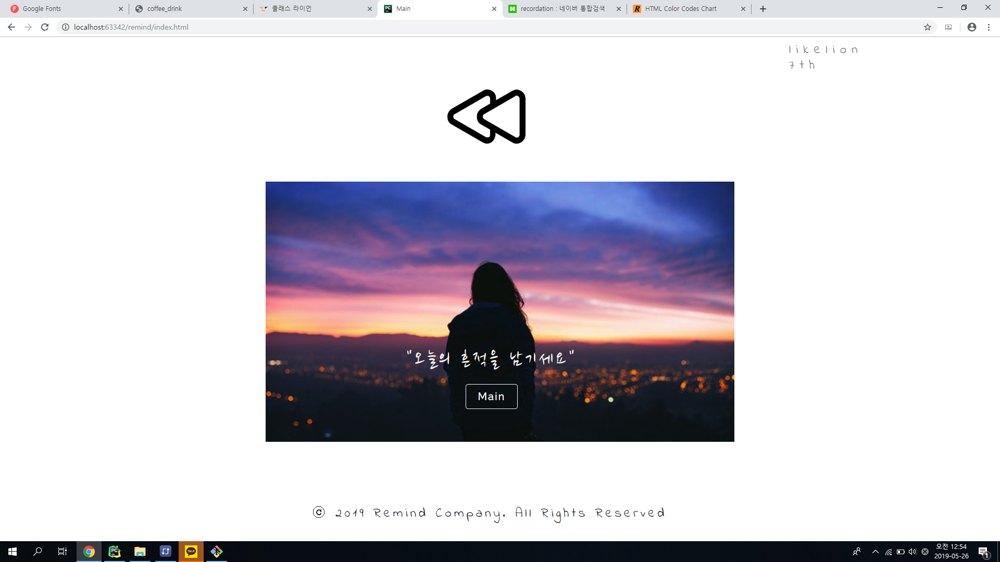
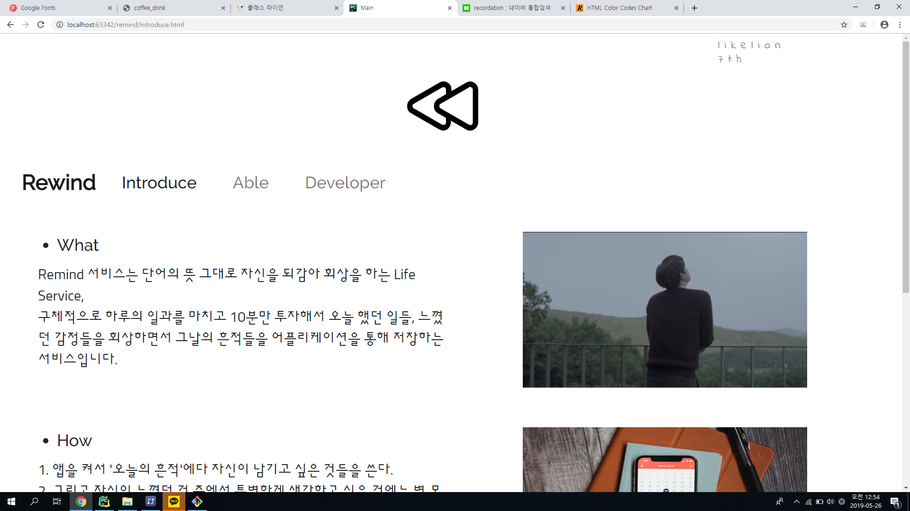
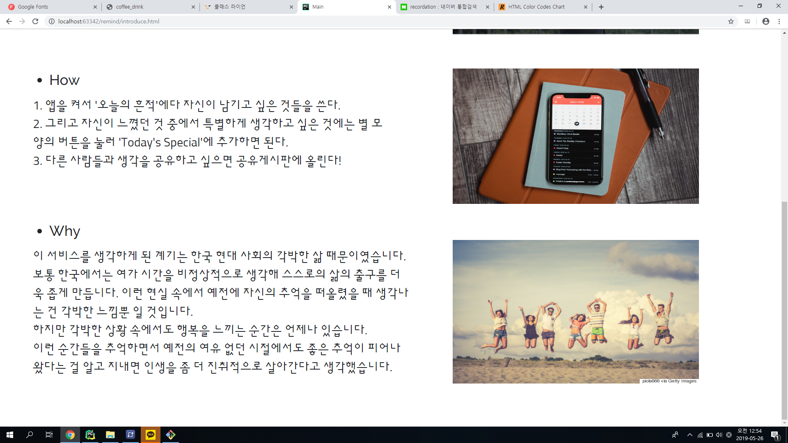
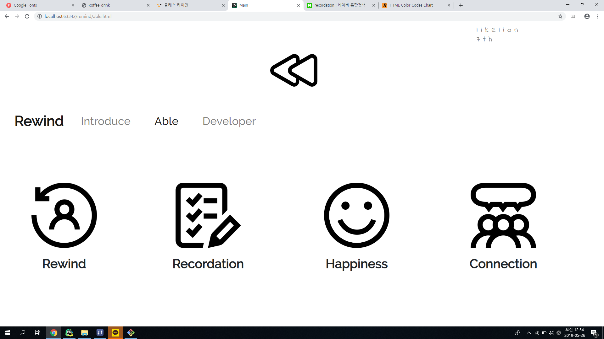
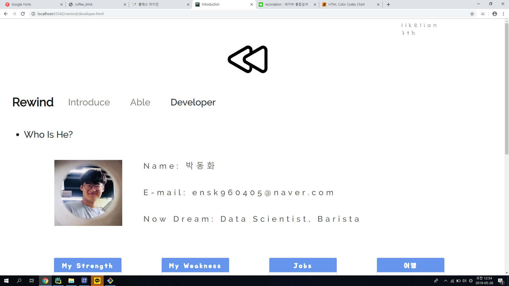
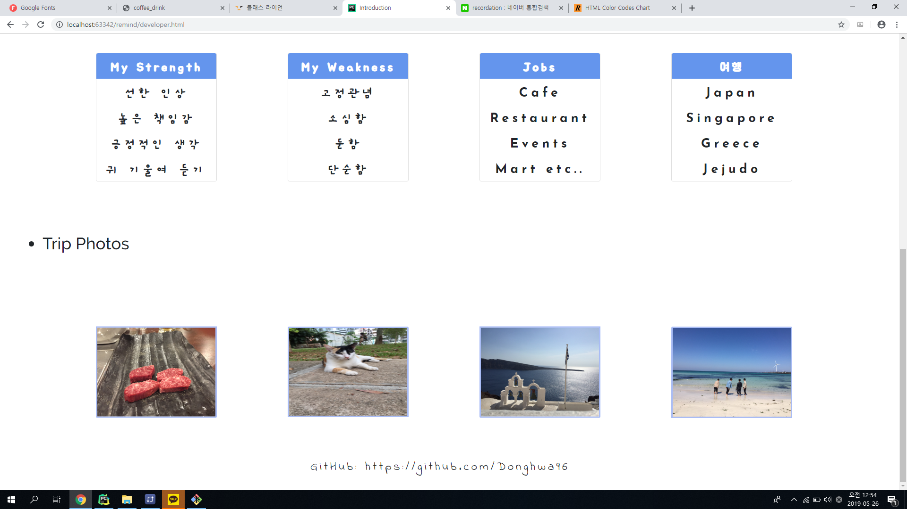

<h1>Remind 서비스</h1>
<h2>구현 의도</h2>

지원 당시에 거창하게 서비스를 만들고 싶어서 앱을 이용한 서비스를 만들고 싶었다고 했다. 그래서 html, css, bootstrap으로는 실현시키지는 못해서(어차피 못한다) 서비스를 설명하려는 방향으로 초점을 두었다. 남은 교육과 자체 공부를 통해서 이 서비스를 만들어서 사람들에게 조금이나마 도움이 되고 싶다.

<h2>오류 내용</h2>

이미지 옆에 텍스트를 정렬시키는 게 어려웠는데 구글링해서 참고를 해보니 img의 align을 left로 정하고 margin을 설정해 해결했다.

<h2>만든 소감</h2>

오랜만에 다시 초심으로 돌아온 기분이다. 다시 html,css 코딩을 하면서 확실히 그때 고생을 하다보니 기억이 잘 나서 허투루 안했다는 사실에 만족을 하지만 엄청 발전하지는 않아서 더 노력해야겠다는 생각이 들었다.

<h2>참고 문서</h2>

http://blog.daum.net/_blog/BlogTypeView.do?blogid=0Bf7U&articleno=12552470
-- 이미지 옆에 텍스트 정렬하는데 참고를 했다.

